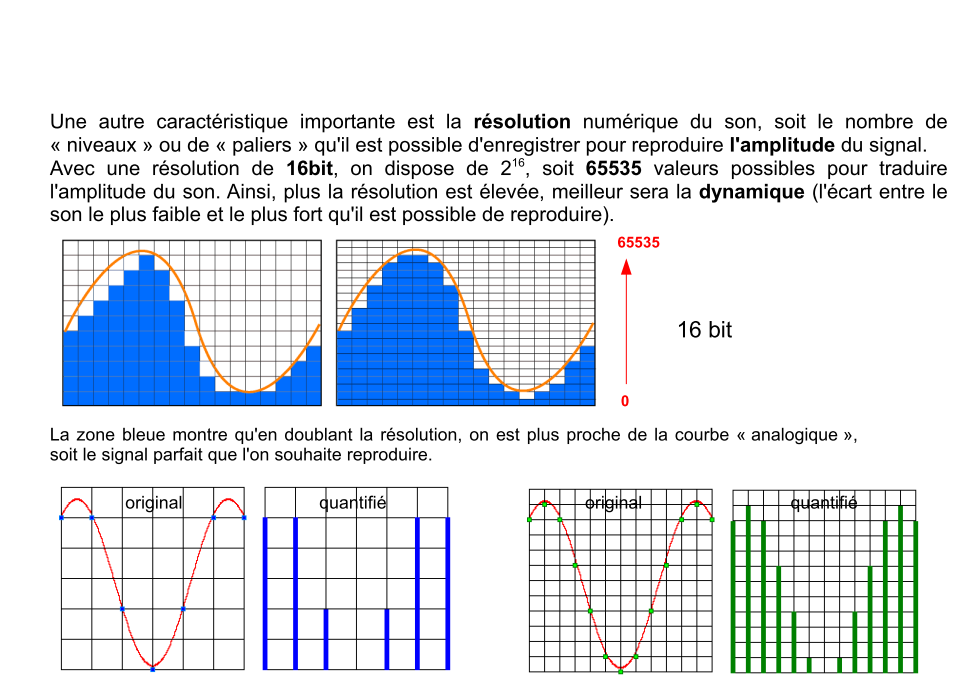

# SoundDesign-references-practices
This repo is a french introduction to pure-data programming langage. It emphasis on linking historical references to practical learning pure-data learning. It takes about 15 hours of practice and it is taught at 'l'Ecole de Design Nantes Atlantique'.

Ce repo regroupe les supports de cours relatif à l'enseignement "Sound Design pratique et références". Il ne se veut pas exhaustif, ni ne représente une approche musicologique relevant de la vérité. Il s'agit plutôt d'une mise en lien de pratiques historiques de design sonore avec des exemples pratiques d'implémentations dans le langage Pure-Data en vue d'une initiation.

http://puredata.info/

Les exemples sont destinés à être utilisés avec Pure-Data vanilla : http://msp.ucsd.edu/software.html

Pour une prise en main de Pure-Data en complète autonomie il est plutôt conseillé de se tourner vers ce cours : https://github.com/b2renger/Introduction_Pure_Data

## Acoustique et Perception auditive

- [Kahn Academy - the science and mathematics of sound](https://www.khanacademy.org/math/math-for-fun-and-glory/vi-hart/singing/v/what-is-up-with-noises-the-science-and-mathematics-of-sound-frequency-and-pitch)

- [Comment fonctionnent nos oreilles ?](https://jig.space/view?jig=1o7LbAKd) 

- [Comment fonctionne un haut parleur ?](https://jig.space/view?jig=8pO80mOY)  

### Les sciences du son

### Les processus cognitifs de la perception sonore

### Les caractéristiques du son

s

#### Les courbes de Fletcher

#### L'audio-numérique

## Références artistiques

- [1876 - Richard Wagner - Der Ring des Niebelungen](https://youtu.be/CUFWNKFajjA?t=1h10m40s) (de 1:10:40s à 1:12:00 environs)

- [1913 - Luigi Russolo  - l'Art des bruits](https://www.youtube.com/watch?v=8GpN5FHO60c) - 
    [Luigi Russolo sur Wikipédia](https://fr.wikipedia.org/wiki/Luigi_Russolo)

- [1933 - Duke Ellington - Daybreak Express](https://www.youtube.com/watch?v=TX3UBxF6LIA)

- [1948 - Pierre Schaeffer - Etude aux chemins de fer](https://www.youtube.com/watch?v=N9pOq8u6-bA&index=6&list=RDVHLmitA3o6g)

- [1952 - John Cage - 4'33](https://www.youtube.com/watch?v=JTEFKFiXSx4)

### Débuts de la synthèse sonore (1954-1969)

- [1954 - Karlheinz Stockhausen - "Studie II" Elektronishe Musik](https://www.youtube.com/watch?v=_qi4hgT_d0o)

- 1958 - *création du GRM par Pierre Schaeffer. y passeront : Luciano Berio,  François Bayle, Jean-Claude Risset, Denis Smalley*

- [1967 - Pierre Henry - Psyche rock](https://www.youtube.com/watch?v=AOqfWj0HqNE) (cf : commentaire d'écoute dans documents/Auditions/    )
et pour aller plus loin, documentaire (52min) : [The Art of Sounds](https://www.youtube.com/watch?v=Zsb1w-3iFa8) de Eric Darmont et Franck Mallet. 

- [1968 - Jean-Claude Risset - Suite pour ordinateur Little Boy](https://www.youtube.com/watch?v=8C7I8jjMutk)

- 1969 - *fondation de l'IRCAM, par Pierre Boulez. L'IRCAM est l'institut de recherche et de coordination acoustique et musicale, qui a permis et permet encore à des scientifiques et des compositeurs de travailler ensemble.*

- [1969 - Terry Riley - A Rainbow in curved air](https://www.youtube.com/watch?v=hy3W-3HPMWg)

- [1969 - Philip Glass - Music in similar motion](https://www.youtube.com/watch?v=lfNdtEPi79M)

- [1975 - Philip Glass - Einstein on the beach](https://www.youtube.com/watch?v=WmX_GgozpQs)

### Cinéma, recherche (1970-1985)

- [1973 - Pink Floyd - Money](https://www.youtube.com/watch?v=-0kcet4aPpQ)

- [1974 - Kraftwerk - Autobahn](https://www.youtube.com/watch?v=e11h73WhqK4)

- [1975 - Gérard Grisey - Partiels](https://www.youtube.com/watch?v=jqzukP_BtW8)

- [1978 - Kraftwerk - The Robots](https://www.youtube.com/watch?v=3HiRjblCypw)

- [1977 - Ben Burt - Star Wars - bande annonce originale](https://www.youtube.com/watch?v=vP_1T4ilm8M)

- [1979 - Walter Murch - Apocalypse Now](https://www.youtube.com/watch?v=e5L617dEXlE)

- [Le bruitage et les techniques de foley](https://www.youtube.com/playlist?list=PLenSg5mxivedEDbbW1snBgaozvRgeKoTp) - et [BuzzBox de Nathan Smith](https://www.youtube.com/watch?v=4C_lPvrfP00)

### Quelques dates

De 1857 à 1897 nous sommes dans l'**enregistrement mécanique** du son.
    - Le phonautographe (Edouard Léon Scott de Martinville)
    - Le phonographe (Thomas Edison) 
[page wikipédia sur le phonographe](https://fr.wikipedia.org/wiki/Phonographe)

Fin 19ème début 20 commence l'**enregistrement électromagnétique** qui correspond au transcodage du son en signal électrique
    - les nagras apparaissent dans les années 50 - c'est le début des enregistreurs transportables.
    - les dictaphones et cassettes audio font leur apparition au début des années 60.
[page wikipédia sur l'enregistreur nagra](https://fr.wikipedia.org/wiki/Nagra)

A partir du début des années 80 le CD fait son apparition. A la fin des années 90, il est largement utilisé, les graveurs de CD aussi, ce qui entrainera le boom des home studio.

Dans les années 80 les techniques pour la musique et le traitement du son à des objectifs vidéo-ludiques apparaît. Alors que dans les années 80, les créateurs étaient limités à quelques **fichiers MIDI**, de la synthèse sonore des plus basiques et des **échantillons audio** de faible qualité; l'appartitions des cds permet de stocker plus de sons de meilleur qualité, puis l'augmentation de la puissance de calcul permet l'utilisation d'**effets** en temps réel et la **spatialisation** au début des années 2000.

La plupart des techniques de création sonore découvertes par Pierre Henry et Pierre Schaeffer sont encore utilisées, et de plus en plus facilitées par les évolutions techniques, parmis elles figurent :
- le montage et le micro-montage
- le mixage / montage de plusieurs sources
- la modification de la vitesse de défilement : augmentation pour accélerer mais aussi l'étirement temporel et la lecture à l'envers
- le bouclage
- le filtrage fréquentiel
- la réverbération artificielle
- les échos
- les techniques avancées de prise de son (comme la mise en mouvement du micro lors de la prise de son)

### Design sonore, design musical et interactions (1985-...)

- [1985 - Konji Kondo - Super Mario Bros](https://www.youtube.com/watch?v=ia8bhFoqkVE)

- [1995 - Steve Reich - City Life](https://www.youtube.com/watch?v=BYca8EJlz0g)

- [2005 - Riojy Ikeda - Dataplex](https://www.youtube.com/watch?v=F5hhFMSAuf4) - et [Supersymmetry](http://www.ryojiikeda.com/project/supersymmetry/)

- [2010 - Daito Manabe - Pub Nike](https://www.youtube.com/watch?v=uS1exujG3cY)

### Quelques projets interactifs plus récents

- [Noisy Jelly](https://vimeo.com/38796545)

- [Synchrony](https://vimeo.com/118888577)

- [Liquid Midi](https://vimeo.com/130185068)	

- [Dodecaudion](https://vimeo.com/28651568)

- [Hibou](https://vimeo.com/67895730)

