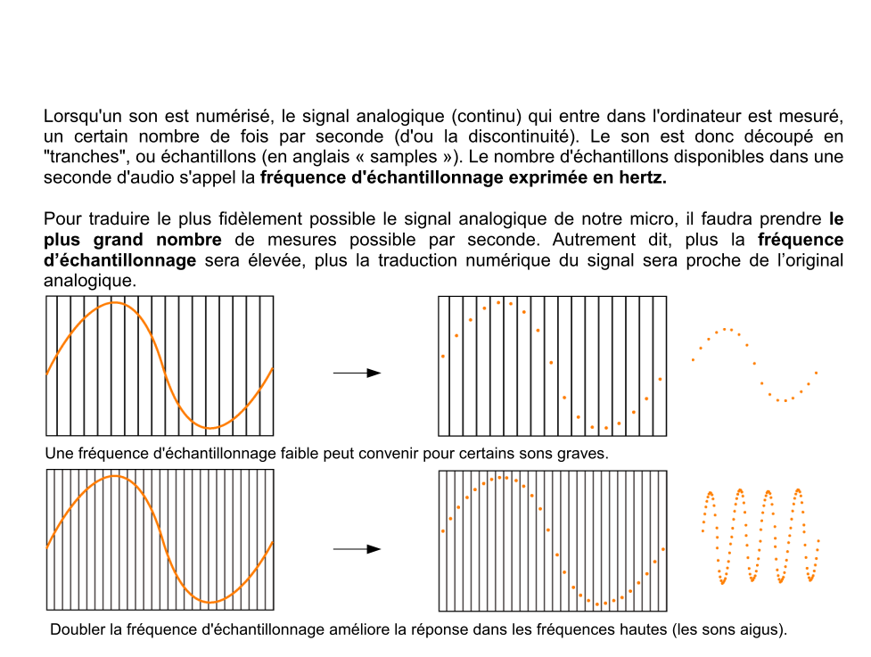

# SoundDesign-references-practices
This repo is a french introduction to pure-data programming langage. It emphasis on linking historical references to practical learning pure-data learning. It takes about 15 hours of practice and it is taught at 'l'Ecole de Design Nantes Atlantique'.

Ce repo regroupe les supports de cours relatif à l'enseignement "Sound Design pratique et références". Il ne se veut pas exhaustif, ni ne représente une approche musicologique relevant de la vérité. Il s'agit plutôt d'une mise en lien de pratiques historiques de design sonore avec des exemples pratiques d'implémentations dans le langage Pure-Data en vue d'une initiation. 

Ce premier repo regroupe les liens théoriques et différentes ressources relatives à l'audio numérique, le bruitage, la composition musicale etc.

Un second repo centralise les ressources autour de pure-data :  https://github.com/b2renger/Introduction_Pure_Data

## Acoustique et Perception auditive

- [Kahn Academy - the science and mathematics of sound](https://www.khanacademy.org/math/math-for-fun-and-glory/vi-hart/singing/v/what-is-up-with-noises-the-science-and-mathematics-of-sound-frequency-and-pitch)

- [Science étonante - les mathématiques et la musique](https://www.youtube.com/watch?v=cTYvCpLRwao)

- [Comment fonctionnent nos oreilles ?](https://jig.space/view?jig=1o7LbAKd) 

- [Comment fonctionne un haut parleur ?](https://jig.space/view?jig=8pO80mOY)  

### Les sciences du son

### Les processus cognitifs de la perception sonore

### Les caractéristiques du son

s

#### Les courbes de Fletcher

#### L'audio-numérique

## Références artistiques

- [1876 - Richard Wagner - Der Ring des Niebelungen](https://youtu.be/CUFWNKFajjA?t=1h10m40s) (de 1:10:40s à 1:12:00 environs)

- [1913 - Luigi Russolo  - l'Art des bruits](https://www.youtube.com/watch?v=8GpN5FHO60c) - 
    [Luigi Russolo sur Wikipédia](https://fr.wikipedia.org/wiki/Luigi_Russolo)

- [1933 - Duke Ellington - Daybreak Express](https://www.youtube.com/watch?v=TX3UBxF6LIA)

- [1948 - Pierre Schaeffer - Etude aux chemins de fer](https://www.youtube.com/watch?v=N9pOq8u6-bA&index=6&list=RDVHLmitA3o6g)

- [1952 - John Cage - 4'33](https://www.youtube.com/watch?v=JTEFKFiXSx4)

### Débuts de la synthèse sonore (1954-1969)

- [1954 - Karlheinz Stockhausen - "Studie II" Elektronishe Musik](https://www.youtube.com/watch?v=_qi4hgT_d0o)

- 1958 - *création du GRM par Pierre Schaeffer. y passeront : Luciano Berio,  François Bayle, Jean-Claude Risset, Denis Smalley*

- [1961 - IBM 7094 - Daisy Bell](https://www.youtube.com/watch?v=41U78QP8nBk)

    => [Aaron Koblin - A Bicycle built for 2000](http://www.bicyclebuiltfortwothousand.com/)

- [1967 - Pierre Henry - Psyche rock](https://www.youtube.com/watch?v=AOqfWj0HqNE) (cf : commentaire d'écoute dans documents/Auditions/    )
et pour aller plus loin, documentaire (52min) : [The Art of Sounds](https://www.youtube.com/watch?v=Zsb1w-3iFa8) de Eric Darmont et Franck Mallet. 

- [1968 - Jean-Claude Risset - Suite pour ordinateur Little Boy](https://www.youtube.com/watch?v=8C7I8jjMutk)

- 1969 - *fondation de l'IRCAM, par Pierre Boulez. L'IRCAM est l'institut de recherche et de coordination acoustique et musicale, qui a permis et permet encore à des scientifiques et des compositeurs de travailler ensemble.*

- [1969 - Terry Riley - A Rainbow in curved air](https://www.youtube.com/watch?v=hy3W-3HPMWg)

- [1969 - Philip Glass - Music in similar motion](https://www.youtube.com/watch?v=lfNdtEPi79M)

- [1975 - Philip Glass - Einstein on the beach](https://www.youtube.com/watch?v=WmX_GgozpQs)

### Cinéma, recherche (1970-1985)

- [1973 - Pink Floyd - Money](https://www.youtube.com/watch?v=-0kcet4aPpQ)

- [1974 - Kraftwerk - Autobahn](https://www.youtube.com/watch?v=e11h73WhqK4)

- [1975 - Gérard Grisey - Partiels](https://www.youtube.com/watch?v=jqzukP_BtW8)

- [1978 - Kraftwerk - The Robots](https://www.youtube.com/watch?v=3HiRjblCypw)

- [1977 - Ben Burt - Star Wars - bande annonce originale](https://www.youtube.com/watch?v=vP_1T4ilm8M)

- [1979 - Walter Murch - Apocalypse Now](https://www.youtube.com/watch?v=e5L617dEXlE)

- [Le bruitage et les techniques de foley](https://www.youtube.com/playlist?list=PLenSg5mxivedEDbbW1snBgaozvRgeKoTp) - et [BuzzBox de Nathan Smith](https://www.youtube.com/watch?v=4C_lPvrfP00)

### Quelques dates

De 1857 à 1897 nous sommes dans l'**enregistrement mécanique** du son.
    - Le phonautographe (Edouard Léon Scott de Martinville)
    - Le phonographe (Thomas Edison) 
[page wikipédia sur le phonographe](https://fr.wikipedia.org/wiki/Phonographe)

Fin 19ème début 20 commence l'**enregistrement électromagnétique** qui correspond au transcodage du son en signal électrique
    - les nagras apparaissent dans les années 50 - c'est le début des enregistreurs transportables.
    - les dictaphones et cassettes audio font leur apparition au début des années 60.
[page wikipédia sur l'enregistreur nagra](https://fr.wikipedia.org/wiki/Nagra)

A partir du début des années 80 le CD fait son apparition. A la fin des années 90, il est largement utilisé, les graveurs de CD aussi, ce qui entrainera le boom des home studio.

Dans les années 80 les techniques pour la musique et le traitement du son à des objectifs vidéo-ludiques apparaît. Alors que dans les années 80, les créateurs étaient limités à quelques **fichiers MIDI**, de la synthèse sonore des plus basiques et des **échantillons audio** de faible qualité; l'appartitions des cds permet de stocker plus de sons de meilleur qualité, puis l'augmentation de la puissance de calcul permet l'utilisation d'**effets** en temps réel et la **spatialisation** au début des années 2000.

La plupart des techniques de création sonore découvertes par Pierre Henry et Pierre Schaeffer sont encore utilisées, et de plus en plus facilitées par les évolutions techniques, parmis elles figurent :
- le montage et le micro-montage
- le mixage / montage de plusieurs sources
- la modification de la vitesse de défilement : augmentation pour accélerer mais aussi l'étirement temporel et la lecture à l'envers
- le bouclage
- le filtrage fréquentiel
- la réverbération artificielle
- les échos
- les techniques avancées de prise de son (comme la mise en mouvement du micro lors de la prise de son)

### Design sonore, design musical et interactions (1985-...)

- [1985 - Konji Kondo - Super Mario Bros](https://www.youtube.com/watch?v=ia8bhFoqkVE)

- [1995 - Steve Reich - City Life](https://www.youtube.com/watch?v=BYca8EJlz0g)

- [2005 - Riojy Ikeda - Dataplex](https://www.youtube.com/watch?v=F5hhFMSAuf4) - et [Supersymmetry](http://www.ryojiikeda.com/project/supersymmetry/)

- [2010 - Daito Manabe - Pub Nike](https://www.youtube.com/watch?v=uS1exujG3cY)

### Quelques projets interactifs plus récents

- [Ping Pong FM](https://vimeo.com/184253111)

- [Noisy Jelly](https://vimeo.com/38796545)

- [Synchrony](https://vimeo.com/118888577)

- [Liquid Midi](https://vimeo.com/130185068)	

- [Dodecaudion](https://vimeo.com/28651568)

- [Hibou](https://vimeo.com/67895730)

## Production audio : ressources et références pratiques 

### Retours sur le séminaire audiovisuel && la production audio à l'image

Lors d'un travail de montage de son à l'image, il faut particulièrement faire attention au **mixage** et à l'**intelligibilité** des sons : pour les débutant le mixage est souvent un peu grossier (les nouveaux sons arrivent trop vite, et prennent trop de place dans l'espace sonore ce qui a tendance à déséquilibrer l'ensemble), un bon mixage se fait en diminuant le volume des sons périphériques à celui que l'on veut mettre en valeur (et non en augmentant le volume de celui qu'on l'on souhaite entendre !).Le recours au positionnement des sources dans l'espace stéréo permet aussi d'améliorer l'intelligibilité. Enfin il est absolument nécessaire d'utiliser des fondus ! Ces opérations techniques permettent de gagner en intelligibilité et permettent d'obtenir des ambiances avec plus de relief et de nuances.

D'une manière générale les débutants on tendance à trop se concentrer sur des échantillons sonores (provenant d'internet) sans les transformer. Lorsque vous lisez un fichier audio, il est possible de modifier sa vitesse et l'endroit précis du fichier que l'on souhaite lire, il est aussi possible d'ajouter des effets audio (filtres, reverbs etc...) qui le modifieront au moment de sa lecture selon les paramètres que vous aurez choisis : **le son est une matière que vous pouvez modeller**.

Lorsqu'une vidéo comporte une voix-off et de la musique il est primordial de faire en sorte que la voix-off soit comprise sans avoir le moindre effort à fournir, cela implique de baisser le niveau des ambiances et musiques lorsque celle-ci intervient (particulièrement dans un mode "reportage").

Ne récupérez pas de sons provenant de vidéos youtube ! (Au delà des éventuels problèmes de droits d'auteur) youtube ajoute des algorithmes de compression à l'upload qui dégradent trop la qualité audio pour en faire un usage professionnel (sur des enceintes de pc on entend déjà les artefacts sonores de cette compression, sur des enceintes de monitoring ou n'importe quel système audiophile cela devient réellement génant). 

Deux derniers points qui sont importants : 
- faîtes attention à l'utilisation de musiques très connues et forcément connotées : cela peut-être dangereux. Si on veut faire une référence explicite à une autre oeuvre pourquoi pas mais dans la plupart des cas il faut éviter.
- lorsqu'il y a des actions répétées à différents moments il est préférable d'introduire un peu de variation dans les sons sinon ceux-ci peuvent vite devenir agaçants.

[Pour aller un peu plus loin sur le mixage](http://productionadvice.co.uk/using-eq/)

### Bruitage + musique = sound design 

Le sound design représente l'ensemble des disciplines liées au son d'une manière directe ou indirecte :  de l'enregistrement à la diffusion en passant par toutes les étapes plus ou moins techniques de création et de production.

Dans beaucoup de cas, on peut assimiler notre **bruitage** à l'**ancrage dans le réel** et notre **musique** à la portée **fictionnelle** / **narrative** / **émotionnelle** que l'on veut donner à notre projet. 

Cette vision des choses permet de mettre en perspective les notions de compositions avec des bruits évoquées par Luigi Russolo ou Pierre Schaeffer. Dans cet axe de travail composer des éléments musicaux à l'aide d'éléments provenant de l'univers du bruitage permet d'amener de la réalité dans le fictionnel, et inversement l'utilisation de sons musicaux pour ponctuer des éléments normalement bruités permet d'amener de la fiction dans le réel.

Ces deux approches du travail sonore doivent trouver un moyen de dialoguer entre-elles, pour enrichir la narration.

Walt Disney s'est beaucoup intéressé au rapport image / son. Le long métrage Fantasia ainsi que de nombreux courts sont en réalité des mises en image, mouvement d'oeuvre musicales classiques ou jazz. 

- 

Certains font aussi de la vulgarisation musicale :

- [1953 - Toot, Whistle, Plunk and Boom](https://www.youtube.com/watch?v=8iVf0pPHvjc) nous apprend d'où proviennent nos instruments de musique modernes.

- [1959 - Donald in Mathmagic land](https://youtu.be/AJgkaU08VvY?t=2m39s) nous explique comment nous en sommes arrivés à la notion de gammes que nous utilisons encore actuellement.

### Logiciels de création audionumérique

[Reaper](https://www.reaper.fm/download.php)

#### Pourquoi reaper ?
Reaper est un outil très complet de qualité professionelle. Il permet d'éditer de l'audio, de composer et de travailler l'audio à l'image. Il est proposé a des tarifs très avantageux étant donné la qualité du logiciel et est disponnible pour toutes les plateformes (une version linux est actuellement en beta)

Il existe un myriade d'alternatives plus où moins couteuses et plus ou moins faciles à prendre en main : de Garage Band à ProTools. Certains sont plus orientés composition musicale ( Garage Band, Abbleton Live, Bitwig, FL Studio, Lmms ...), d'autres plus généraux (Ardour, Reaper, Cubase, ProTools, Logic ....)

Ces logiciels sont des **DAW** (Digital Audio Workstation), ils permettent :
- d'importer des fichier audio et de les manipuler (montage, transformations etc.) 
- d'utiliser des chaines d'effets dont les paramètres sont automatisables.
- d'utiliser la notation **MIDI** pour composer de la musique et la jouer avec des **instruments virtuels**.

Les **effets** et **instruments virtuels** ne sont pas forcément tous inclus dans un DAW, beaucoup d'éditeurs de logiciels audio éditent des **plug-ins** qui ont pour but d'étendre les possibilités sonores des DAWs. Le format le plus connu est le format **VST** (Virtual Studio Technology) utilisé par reaper et qui est cross-plateform, mais il en existe d'autres - propres à certains DAW ou propres à des systèmes d'exploitation (RTAS, AU, LADSPA, DSSI, LV2 ...) 

#### Ressources Reaper

[Page de vidéos officielles](https://www.reaper.fm/videos.php)

et quelques vidéos supplémentaires couvrant les bases :

- [audio editing](https://www.youtube.com/watch?v=kn2SlBMpzwY)
- [automations](https://www.youtube.com/watch?v=o0-4Tt3aTBE&list=PLh1Qaso9T1U0B17AXNLlvmUFuF8lWX-o8&index=75)
- [nettoyage d'un enregistrement de mauvaise qualité](https://www.youtube.com/watch?v=S9RnX2ZqsZs&list=PLh1Qaso9T1U0B17AXNLlvmUFuF8lWX-o8&index=68)
- [midi editing](https://www.youtube.com/watch?v=_hxgt2oQeOE)
- [Boucing - exporter de l'audio](https://www.youtube.com/watch?v=2EUBto9isUM&list=PLh1Qaso9T1U0B17AXNLlvmUFuF8lWX-o8&index=16)

### Musique générative et audio procédural

Lorsque l'on parle de musique ou d'audio génératif, on parle le plus souvent de l'utilisation de code informatique pour permettre de l'interactivité entre différents éléments musicaux ou entre un humain et une production audio.

Certains DAW permettent de recevoir des informations d'autres logiciels via le réseau (protocole OSC par exemple qui est très utilisé et que vous découvrerez dans vos cours de programation avec Processing et Pure-data)

- [musique générative avec la Web audio api](https://teropa.info/generative-music-slides/#/title)
- [audio procédural avec Pure-Data](http://www.mgsx.net/articles/pd/bfxr-like-with-pd/bfxr-like-with-pd.html)

Ces problématiques seront l'objet des séances pratiques pour lesquelles nous utiliserons le logiciel Pure-Data, les ressources pour ces séances pratiques sont disponnibles [ici](https://github.com/b2renger/Introduction_Pure_Data)

### Ressources et liens 

#### Echantillons gratuits
- [musicscreen](http://www.musicscreen.be/musique-libre-de-droit-gratuite.html)
- [freesound](http://www.freesound.org)

#### Applications web 
- [cercle des quintes - harmonie](http://randscullard.com/CircleOfFifths/)
- [learn making music by Abbleton - introduction à la pratique des musiques électroniques](https://learningmusic.ableton.com/)
- [chrome music lab - expérimentations audio et html5](https://musiclab.chromeexperiments.com/)
- [sfxr - application de création de bruitages](http://sfxr.me/)
- [soundstation - daw en ligne](https://soundation.com/studio)
- [patatap - synthétiseur visuel et sonore](http://patatap.com/)
- [Doodle google en hommage à Oscar Fischinger](https://www.google.com/logos/doodles/2017/fischinger/fischinger17.8.html?hl=fr&doodle=undefined)
- [Doodle google anniversaire du hip hop](https://www.google.com/doodles/44th-anniversary-of-the-birth-of-hip-hop)
- [harmony directed layout - en cours](https://b2renger.github.io/p5js_harmony-directed-layout/index.html)

#### Applications android 
- [Caustic - Daw](https://play.google.com/store/apps/details?id=com.singlecellsoftware.caustic)
- [7pad - composition musicale](https://play.google.com/store/apps/details?id=com.mixtics.sevenpad)
- [Ninja jam - application ninja tunes](https://play.google.com/store/apps/details?id=net.ninjatune.ninjaJamm)
- [mes applications personnelles][https://play.google.com/store/apps/developer?id=b%C3%A9renger+recoules]
- [liste d'application android gratuites](http://pareekattimusic.blogspot.fr/2017/06/list-of-free-android-music-apps-only.html)

#### Jeux vidéos

##### Historiques
- [1996 - PaRappa the rapper](https://www.youtube.com/watch?v=hg61X2Lg-qQ)
- [1997 - Thief the dark project](https://www.youtube.com/watch?v=hg61X2Lg-qQ)

##### Gameplay comme source de production musicale
- [pug luv beat](https://www.youtube.com/watch?v=V0i18_--8Yc)
- [minimetro](https://www.youtube.com/watch?v=w22NFOtaWVU&feature=youtu.be)

##### Accessibles sourds et malentendants - audio games
- [A blind Legend](https://play.google.com/store/apps/details?id=com.dowino.ABlindLegend&hl=fr)
- [Audio game hub](https://play.google.com/store/apps/details?id=com.AUT.AudioGameHub)

#### Divers
- [Historique du format MIDI](https://www.midi.org/articles/midi-history-chapter-1)
- [Neural networks for generating music](https://medium.com/artists-and-machine-intelligence/neural-nets-for-generating-music-f46dffac21c0)
- [studio de création multimédia expérimental](http://www.binaura.net)
- chaine youtube de remix et d'experimentations autour de la musique : [Andrew Huang](https://www.youtube.com/watch?v=i3tiuGVDDkk)
- [Allan Menken - compositeur disney](https://www.youtube.com/watch?v=TTj6oR4kMC0&t=84s)
- [ASMR](http://www.lemonde.fr/pixels/video/2017/09/12/comment-une-video-peut-elle-provoquer-un-orgasme-cerebral_5184542_4408996.html)
- [Enhancing Mobile interactions](https://medium.com/facebook-design/how-to-enhance-mobile-interactions-with-sound-design-3c3b30e98177)

